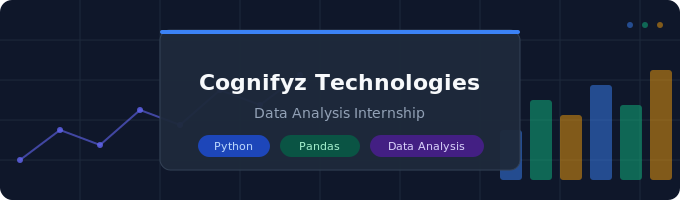

# 🍽️ Cognifyz Technologies — Data Analysis Internship


> Data Analysis internship tasks completed at **Cognifyz Technologies**, focused on analyzing a real-world restaurant dataset to uncover insights about cuisines, ratings, locations, pricing, and customer preferences.

---

## 📌 About the Internship

This repository contains all the tasks completed during my **Data Analysis Internship** at **Cognifyz Technologies** — a leading technology company specializing in data science, AI, and machine learning solutions.

The internship required completing **any 2 of 3 levels**, each containing 4 tasks of increasing complexity.

---

## 📁 Repository Structure

```
cognifyz-data-analysis/
│
├── Level-1/
│   ├── Task1_Top_Cuisines.ipynb
│   ├── Task2_City_Analysis.ipynb
│   ├── Task3_Price_Range_Distribution.ipynb
│   └── Task4_Online_Delivery.ipynb
│
├── Level-2/
│   ├── Task1_Restaurant_Ratings.ipynb
│   ├── Task2_Cuisine_Combination.ipynb
│   ├── Task3_Geographic_Analysis.ipynb
│   └── Task4_Restaurant_Chains.ipynb
│
├── Level-3/
│   ├── Task1_Restaurant_Reviews.ipynb
│   ├── Task2_Votes_Analysis.ipynb
│   └── Task3_Price_Range_vs_Services.ipynb
│
└── README.md
```

---

## 🧪 Tasks Overview

### 📗 Level 1 — Exploratory Data Analysis

| Task | Title | Description |
|------|-------|-------------|
| Task 1 | **Top Cuisines** | Identify the top 3 most common cuisines and calculate the percentage of restaurants serving each |
| Task 2 | **City Analysis** | Find the city with the most restaurants; calculate average ratings per city and identify the highest-rated city |
| Task 3 | **Price Range Distribution** | Visualize price range distribution using charts; calculate percentage of restaurants in each price category |
| Task 4 | **Online Delivery** | Find what percentage of restaurants offer online delivery; compare ratings with vs. without delivery |

---

### 📘 Level 2 — Intermediate Analysis

| Task | Title | Description |
|------|-------|-------------|
| Task 1 | **Restaurant Ratings** | Analyze distribution of aggregate ratings; find the most common rating range and average votes |
| Task 2 | **Cuisine Combination** | Identify the most common cuisine combinations; check if certain combos tend to have higher ratings |
| Task 3 | **Geographic Analysis** | Plot restaurant locations on a map using lat/long; identify geographic patterns and clusters |
| Task 4 | **Restaurant Chains** | Detect restaurant chains in the dataset; analyze their ratings and popularity |

---

### 📕 Level 3 — Advanced Analysis

| Task | Title | Description |
|------|-------|-------------|
| Task 1 | **Restaurant Reviews** | Analyze text reviews for positive/negative keywords; explore relationship between review length and rating |
| Task 2 | **Votes Analysis** | Identify highest/lowest voted restaurants; analyze correlation between votes and ratings |
| Task 3 | **Price Range vs. Services** | Examine relationship between price range and availability of online delivery and table booking |

---

## 🛠️ Tech Stack

- **Python** — Core programming language
- **Pandas & NumPy** — Data manipulation and analysis
- **Matplotlib & Seaborn** — Data visualization
- **Folium / Plotly** — Geographic mapping
- **NLTK / WordCloud** — Text analysis (Level 3)
- **Google Colab** — Development environment

---

## 📊 Key Insights

- 🍜 Identified the top cuisines dominating the restaurant landscape
- 🏙️ Discovered which cities have the most restaurants and highest average ratings
- 💰 Analyzed how price range relates to customer ratings and service offerings
- 🗺️ Mapped geographic clusters of restaurants using coordinates
- ⭐ Explored what drives higher ratings — delivery, price, cuisine type
- 🔗 Found popular restaurant chains and compared their performance

---

## 🚀 How to Run

1. Clone the repository:
   ```bash
   git clone https://github.com/your-username/cognifyz-data-analysis.git
   ```
2. Open any notebook in **Google Colab** or **Jupyter Notebook**
3. Run all cells sequentially

---

## 🙏 Acknowledgements

Thanks to **[Cognifyz Technologies](https://www.cognifyz.com)** for this opportunity.
📧 contact@cognifyz.com | 🔗 [@cognifyz-Technologies](https://www.linkedin.com/company/cognifyz-technologies)

---

*#cognifyz #cognifyzTech #cognifyzTechnologies #DataAnalysis #Python #DataScience #Internship*
